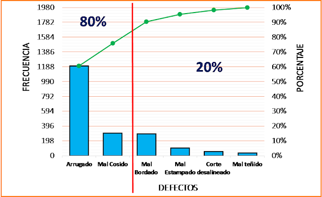
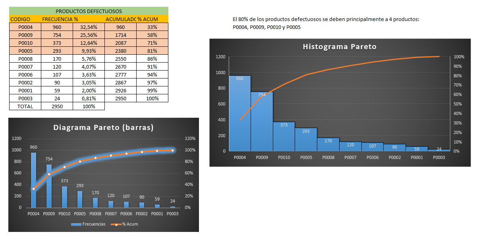

# Principio Pareto (Aplicacion Excel) 

## 📊 Ejemplo Aplicacion Pareto Excel

A partir de este ejemplo en excel, partiendo de algunos datos recolectados sobre productos defectuosos detectados
en un proceso de fabricacion, aplicamos el principio de Pareto para determinar que el 20% de algunos produtos (4)
son las causas el 80% de los productos defectuosos encontrados en un lapso de tiempo determinado.
Gracias a este analisis rapido podemos enfocar controles de calidad y modificaciones en esos productos causantes
de la mayor parte del problema planteado.

## 🖼️ Concepto

## 🖼️ Vista previa

## 🚀 Tecnologías
- Microsoft Excel (grafico de pareto y/o grafico de barras combinado adaptado).
- Principio de Pareto (analisis ABC).

#### 👨‍💻 Author
###### Gabriel Gallardo
🔗 [LinkedIn Profile](https://www.linkedin.com/in/gerardo-gabriel-gallardo-12619ab5)
